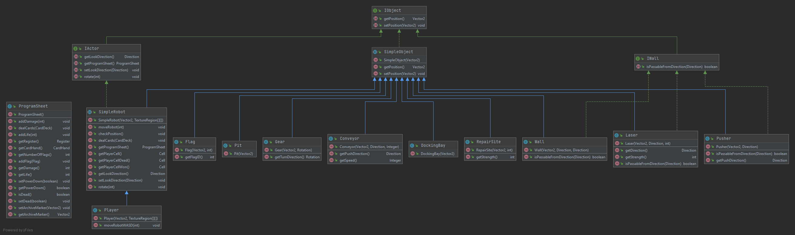
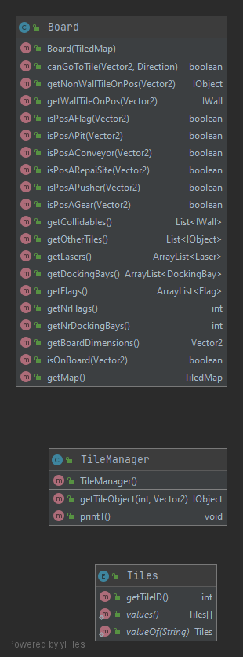
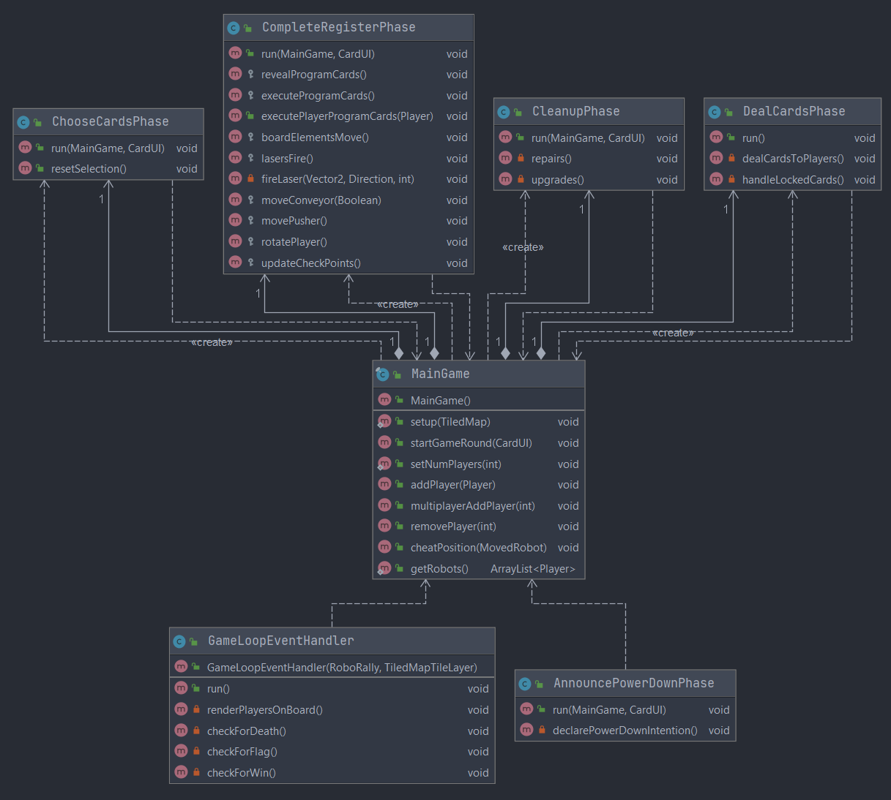
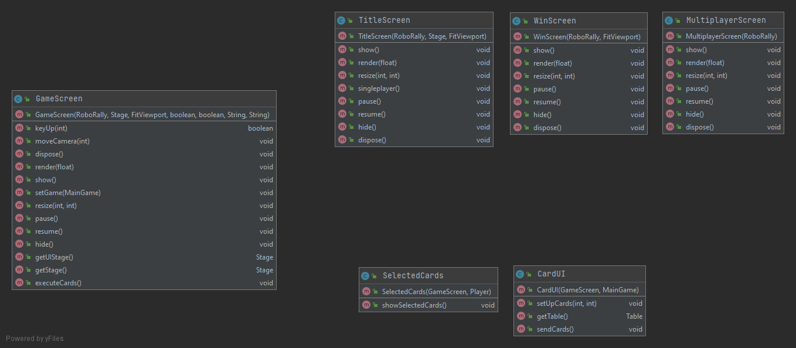
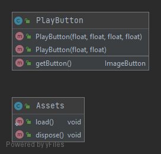
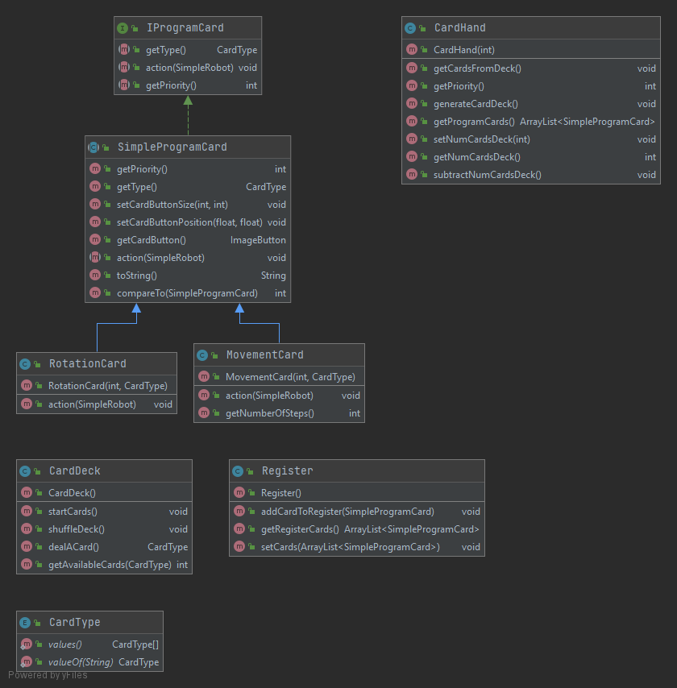

# INF112 Oblig 4 - Import TeamName

## Deloppgave 1: Team og prosjekt

<b>Referat</b>
Referat fra hvert møte gruppen har holdt finnes i repository under Deliverables/Møtereferat

<b>Hvordan fungerer rollene i teamet? Trenger dere andre roller?</b>
Teamet har beholdt rollene fra forrige Deliverable og erfarer at rollene slik de er nå fungerer godt.

<b>Erfaringer fra prosjektmetodikk:</b>
Fra starten av prosjektet har gruppen drevet med parprogrammering i arbeidsmøte. Særlig i når uavhengige komponenter av spillet flettes sammen har parprogrammering vært viktig.

Gruppen bestemte seg for en Kanban-basert arbeidsmetodikk, som gruppen erfarer har fungert bra. Prosjekttavlen oppdateres ved hvert møte, og nye arbeidsoppgaver legges til mens gruppen er samlet. Dette forenkler tildeling av arbeidsopgaver.
Gruppen har drevet med parprogrammering ved flere av møtene som har blitt holdt.

<b>Retrospektiv</b>
Enkelte funksjoner (som multiplayer, og cards) har blitt utviklet individuelt. Vi har prøvd å holde alle gruppemedlemene oppdatert på koden og hvordan den fungerer, slik at alle har mulighet å lage endringer.

<b>Hva kan forbedres?</b>
Vår prioritet fra starten av prosjektet var spillogikk. Vi anser det som viktig at spillogikk prioriteres, da dette også får implikasjoner for multiplayer komponenten av spillet. Likevel har gruppen brukt mye tid på det visuelle aspektet av spillet. Et spill som ser bra ut og er intuitivt er viktig for helhetsopplevelsen for brukerne.  Likevel gir det mening å utsette forbedringen av det visuelle aspektet til slutten av prosjekt. Tiden vi ville spart ved å utsette det visuelle kunne vi anvendt på å løse multiplayer komponenten, og innfridd MVP tidligere.

<b>Betydning av fysisk tilstedeværelse</b>

Som gruppe har vi ikke hatt mulighet til å møte fysisk. Vi tenker at dette har slått ut mer negativt enn positivt av følgende grunner.

* Negative sider ved å ikke møte fysisk:
    * Vanskelig å holde god kommunikasjon.
    * Ikke like lett å forklare kode og konsepter.
    * Det er enklere å slakke, siden det ikke er noen som nødvendigvis kan følge med på hva du gjør til enhver tid.
    * Den sosiale arenaen blir ikke like godt utviklet mellom medlemmene. Ofte er det enklere og raskere å jobbe med andre, når man kjenner dem. Det er enklere å gjøre fysisk.

* Positive sider:
    * Enklere med hyppige møter. Siden det er digitalt, kan alle delta selv om man ikke er i Bergen.
    * Reduserer pendletid, og det blir enklere å bruke tid på projektet.

* Konklusjon:
    * Selv om det ble store restriksjoner med fysisk oppmøte. Føler gruppen at projektet ble gjennomført på en god måte. Vi ser nå i etterkant at vi kunne vært mer effektive med kommunikasjon og arbeidsfordeling, men det tyder på at vi har lært mye i dette kurset :-).

<b>Forbedringspunkter</b>
* Gruppen
    1. Kommunikasjon
        * Vi ser at en større tydeliggjøring av ansvar og arbeidsoppgaver kunne spart gruppen for tid.
    2. Oversikt over alle komponenter i kodebasen
        * Gruppen har ved hvert møte brukt en type `standup` der vi forklarer endringer og tillegg til prosjektet. I etterkant ser vi et behov for å ta ekstra gjennomganger, slik at alle har samme forståelse av kodebasen. For eksempel

* Tekniske forbedringspunkter
    1. Mer fokus på multiplayer
        * Dette var en utfordrende bit av prosjektet da ingen av gruppemedlemmen hadde erfaring som vi kunne støtte oss på. Dette sammen med tette tidfrister, resulterte i at vi prioriterte de andre kravene over multiplayer. I etterkant ser vi at hvordan spillet skal bli designet er avhengig multiplayer implementasjonen, og vi måtte refactorere en del for å oppnå MVP krav 6.

<b>Gruppens prioriteringer</b>
Gruppen har prioritert å utvikle kjerne-spillet over komplett multiplayer-funksjonalitet. I kjernespillet legger vi kritisk funksjonalitet utfra spillet slik det beskrives i regelboken. Kollisjoner, utdelelse av kort, eksekvering av kort og runde-håndtering inngår i kjernespillet.
Under Deloppgave "Krav" finnes en nærmere gjennomgang av implementasjon.

<b>Prosjekttavle</b>
[Bilde av prosjekttavle](Projectboard/projectboard_deliv3.png)

<b>Gruppedynamikk og kommunikasjon</b>
Gruppen holder faste møter tre ganger i uken. Vi har en egen Discord server for å dele ressurser og forenkle kommunikasjon.

## Deloppgave 2: Krav

<b> Hvilke krav har vi prioritert? Hva har vi gjort siden forrige innlevering? Møtt MVP? </b>

<b> Fra forrige Deliverable ble følgende MVP innfridd.</b>

    1. Vise et spillebrett
    2. Vise brikke på spillebrett
    3. Flytte brikke (vha taster e.l. for testing)
    4. Robot besøker flagg
    5. Robot vinner ved å besøke flagg
    6. Spille fra flere maskiner *
    7. Dele ut kort
    8. Velge 5 kort
    9. Bevege robot ut fra valgte kort
    
    * En spiller kan tilkoble seg og se spillbrettet

<b> MVP slik prosjektet er nå </b> 

    1. Vise et spillebrett
    2. Vise brikke på spillebrett
    3. Flytte brikke (vha taster e.l. for testing)
    4. Robot besøker flagg
    5. Robot vinner ved å besøke flagg
    6. Spille fra flere maskiner *
    7. Dele ut kort
    8. Velge 5 kort
    9. Bevege robot ut fra valgte kort
    
    * Flere spillere kan tilkoble seg og interacte med hverandre

Fra forrige oblig var det ett krav som ikke ble fullstendig oppfylt:
6. Spille fra flere maskiner

De kravene ble derfor prioritert for denne innleveringen. Slik at alle MVP ble innfridd.
- Vår tolkning: Siden punkt 6, spille fra flere maskiner, er over punkt 7,8, og 9. Tolker vi det slik at MVP for multiplayer *kun* innebærer å vise endringer av andres brikker over nettet. Og *ikke* å også inkludere gameloop elementet av spillet i multiplayer. Multiplayer implementasjonen inkluderer derfor kun bevegelse ved WASD, og ikke valg av kort.

   
<b> Gameloop </b>
Et viktig delområde fra forrige Deliverable ble implementeringen av runder og ferdigstilling av kort utdeling. Spillogikken sjekker hvilke spillere som har låste kort, og fjerner dem fra denne rundens kortbunke. Hver spiller blir bedt om å velge opptil fem kort, og programmet sørger for at et riktig antall kort låses om spilleren har tatt skade. Deretter vil kortene bli utført for rett spiller, og etter kortenes prioritet. Til slutt repareres de robotene som har avsluttet runden sin på et reperasjonssted.

<b> Menysystem</b>
Et mer omfattende meny-system har blitt implementert siden forrige oblig. Måter å få input fra brukeren ble for eksempel lagt til flere av skjermene. Muligheten til å velge kart, antall spillere og blant annet spiller navn ble opprettet. Før dette, var de eneste bruker-valgene singleplayer eller multiplayer(host/join).

<b> Multiplayer </b>
Det er viktig å påpeke at multiplayer refererer til spill på tvers av maskiner.
Multiplayer har blitt implementert slik at MVP innfris. Spiller bevegelser blir nå reflektert på andre maskiner. Altså, dersom en spiller beveger seg på en maskin, så vil spilleren bli bevegd på en annen maskin også.

En stor mengde mindre endringer, samt Junit tester har blitt implementert, men vil ikke bli gjennomgått i detalj. De fleste endringene av betydning vil være loggført i prosjekttavlen.

## <b> Brukerhistorier: </b>

### <b>Brukerhistorie 4.1 - Andre spilleres valg</b>
* "Som bruker ønsker jeg å se andre spilleres trekk"

<b>Akseptansekriterier:</b>
- Å visuelt se andre spilleres bevegelse etter endt runde

<b> Arbeidsoppgaver: </b>
- Spillet registerrer alle spilleres valgte kort
- Spillet viser resultatet av utførelsen etter endt runde

### <b>Brukerhistorie 4.2 - Lifetokens </b>
* "Som bruker ønsker jeg å se hvor mange life tokens jeg har igjen, slik at jeg vet hvor langt jeg er ifra å dø."

<b>Akseptansekriterier:</b>
- Bruker kan visuelt se hvor mange liv han har igjen ved å se på dashbordet når det er hans tur.

<b> Arbeidsoppgaver: </b>
- Hente mengde lifetokens fra robotens .getProgramSheet()
- Tegne dette på GUI, gjennom card UI. 

### <b>Brukerhistorie 4.3 - Roboter beveges steg for steg </b>
* "Som bruker ønsker jeg å se stegvis hvor robotene beveger seg."

<b>Akseptansekriterier:</b>
- Å visuelt se alle roboter gjøre en bevegelse etter hverandre.
- Robotene 'teleporterer' ikke fra et sted til et annet.

<b> Arbeidsoppgaver: </b>
- Endre hvordan bevegelse blir håndtert.
- Undersøke hvordan render() funksjonen i `GameScreen.java` fungerer.

### <b>Brukerhistorie 4.4 - Multiplayer</b>
* "Som spiller vil jeg spille med/mot andre spiller"

<b>Akseptansekriterier:</b>
- Minst to maskiner kan sende informasjon mellom hverandre.
- Maskin 1 får vite i konsoll at maskin 2 har koblet seg til.

<b> Arbeidsoppgaver: </b>

- Lage en server som akspeterer og returnerer packets.
- Gi melding om at en annen maskin har koblet seg til serveren, og eventuelt koblet seg fra serveren.

## Deloppgave 3: Produktleveranse og kodekvalitet

*Dokumentasjon på hvordan spillet bygges og spilles finnes i repositoriets readme fil.*

<b> Operativsystem</b>
Prosjektet kan kjøres på Mac, Linux og Windows. Hver build sjekkes automatisk på Mac og Linux av Travis. Ettersom Travis foreløpig ikke støtter Windows builds, tester vi builds manuelt på Windows. 

<b> Testing </b>
Automatisk tester gjøres gjennom Junit, og manuelle tester er beskrevet i Deliverables/ManualTests.

### <b> Klassediagram </b>
Et oppdatert klassediagram over hele projektet finnes under Deliverables/UML. [Ref](UML/UMLDeliverable2.png)

På grunn av størrelsen på prosjektet og mengden filer har vi valgt å også inkludere mindre diagrammer for å gi en mer presis forklaring.

Enkelt diagram som viser direkte arv i prosjektet er her: [SimpleDiagram](UML/UMLSimpleOverview.png)
Klassene er også gruppert etter hvor ca dem hører til relativt til de andre klassen i prosjektet.

En mer presis gjennomgang basert på diagrammet over følger under:

<b>Ting på brettet</b>

Dette er alle klassene for det som kan eksistere på spillbrettet. Alt arver fra den abstrakte klassen `SimpleObject.java` som implementerer interfacet `IObjects.java`. Dens hoved egenskap er å holde styr på posisjonen til en brikke på brettet.

`DockingBays`, `Gear`, `Pit`, `Conveyor`, `RepairSite`, `Flag`, og `SimpleRobot` arver direkte herifra.

`Lasers`, `Walls`, og `Pushers` er brikker som også har vegg og da kollisjons logikk. De arver fra `IWall` (Som også arver fra `IObject`), som har tilleggsfunksjonen `isPassableFromDirection()` som gir svar om det er en vegg på brikken i gitt rettning.

Til slutt har vi `actors`, som er brikkene som eksiterer i `Player layer` i alle kart. Dette er brikker som beveger seg, styres av mennesker eller AI. Alle `actors` arver fra `IActor`, som holder styr på rettningen til brikken. `SimpleRobot` arver fra `IActor`. Den inneholder alle metodene en robot skal ha, mye av dens informasjon er lagret i `ProgramSheet.java`.

<b>GameBoard - Samle informasjon av brett</b>

Dette er klassen under mappen `Maps` i prosjektet. `Board.java` er hovedklassen, den looper igjennom alle lagene på et kart, lager instanser av objektene den finner, og legger dem til i de relevante listene. Eks, alle "vegg" type brikker blir lagt til i listen `HashMap<> mapCollidables`.

`Tiles.java` er en enum som inneholder alle id-ene til brikkene et kart kan bestå av. `TileManager.java` tar inn en slik id, og retunerer et objekt/instans av dens relevante klasse. Eks, får den id=23, returnerer den en instans av `Wall.java` med informasjonen som gjør den til en brikke med vegg i Øst.

I tillegg har `Board.java` metoder for å spørre hva som er på en gitt posisjon, og om man kan gå fra en posisjon til en nabo, med hensyn til vegger.

<b>GameLoop - spill loopen</b>

Her styres spill loopen som kjører selve spill logikken.

`MainGame.java` oppretter instanser av alle fasene, og begynner spillet. Deretter kaller alle fasene på hverandre rekursivt helt til det er en vinner.

<b>Screens - Skjermene til spillet</b>

Her er alle skjermene i spillet. `Titlescreen` er hovedmenyen, `Multiplayer` er undermenyen som styer spill over nett, og `GameScreen` er skjermen med spillet. `MapSelectorScreen` gir bruker mulighet til å velge kart, antall spillere, og å navnegi spillerne.

`MultiplayerGameScreen` er skjermen for multiplayer.

I samme package ligger `cardsUI`, denne mappen inneholder skjermene som viser `dashboard/meny` som hver spiller skal ha. Her er logikken for å vise kort og knapper visuelt.
- `CardUI` viser kortene spilleren kan velge mellom.
- `SelectedCards` viser kortene som spiller har valgt. Disse kortene er robotns register. og blir utført i CompleteRegisterPhase.

`WinScreen` er skjermen som vises når en spiller vinner spillet.

<b>Mappen `AssetManager` og `Buttons` - Visuelle resursser i spillet</b>

`Assets.java` er klassen som laster inn alle textures og visuelle resursser og gjør dem tilgjengelige for de andre klassene. Dette gjøres kun her i prosjektet, slik at Single Responsibility er innfrid.

`Buttons.java` inneholder foreløpig knappen som brukes til starten av spillet.

<b>Cards - Spillets forskjellige kort</b>

Alle kort utvider den abstrakte klassen`SimpleProgramCard.java` som implementerer interfacet `IProgramCard.java`. `SimpleProgramCard` inneholder alle generelle egenskaper kort trenger. Det er foreløpig implementert 2 forskjellige kort, `MovementCard.java` og `RotationCard.java`.

`CardType.java` er en enum som inneholder alle mulige kort typer.

`Register.java` og `CardHand.java` er klasser som hver enkelt robot instansierer i sin individuelle `ProgramSheet`. `CardHand` er kortene roboten får utdelt i starten av hver runde. Spilleren velger så 5 av dem, og disse sendes til `Register`. Når spillet skal eksekvere de valgte kortene til spillerene henter ` CompleteRegisterPhase.java` ut kortene fra robotenes`Register`.

 

<b> Tester</b>
Manuelle tester ligger ved `Deliverables/ManuelTests/ManuelTests.md`
Automatiske tester gjøres gjennom Junit rammeverk, og dekker de mest kritiske komponentene av kodebasen.

<b>Arbeidsfordeling</b>

Gruppen har hatt fokus på å gjevne ut kodebidrag med hensyn på mengden linjer og commits.
Vi understreker at mengden commits er en upresis måte å måle mengden arbeid som er gjort mellom teammedlemmer. Iløpet av prosjektet

<b> Bugs/uønsket adferd </b>
En oversikt over kjente feil finnes på hovesiden/Readme. 
