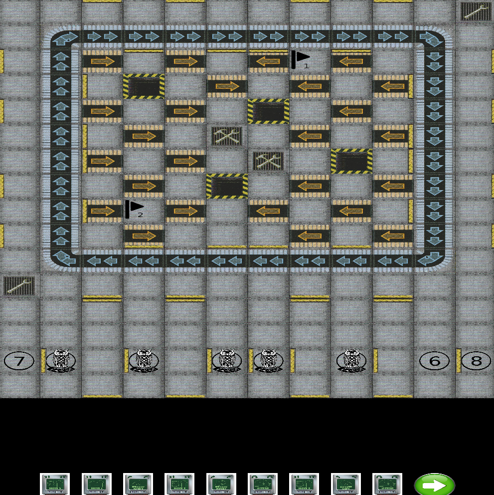

<h1 align="center">INF112 Gruppe 10-2</h1>

### Team Members:
- August Klevberg
- Eivind Mai
- Endre Tønnessen
- Jakob Svemo
- Sondre Eide

## What is Roborally?
Roborally is a boardgame developed in 1985 by Richard Garfield (Creator of Magic the Gathering), published in 1994 by Wizards of the Coast. 
This repo is a digital version of the original mainGame, using the old ruleset from 2005.

The rules can be found here: [Roborally Rules 2005](https://www.fgbradleys.com/rules/rules4/Robo%20Rally%20-%20rules.pdf)

Wiki of the mainGame: [Roborally Wiki](https://www.wikiwand.com/en/RoboRally)
## Project Setup

### Requirements
* Java 8+
* Version Control, git etc.
* Maven

### OS
* Mac
* Linux
* Windows

### Command line
Clone project: ``git clone git@github.com:inf112-v21/Import-TeamName.git``

Build the project.

Run ``Main.java`` located at  `src/main/java/inf112/skeleton/app/Main.java`

### Windows
Install a Java IDE, such as Eclipse or IntelliJ IDEA

Import the project from version control, as a Maven project.
Specify `pom.xml` as the configuration file for Maven.

Run the project, the main class is located at `src/main/java/inf112/skeleton/app/Main.java`, from Project root.

If executed properly you are presented with the main screen of the mainGame.

## How to play
* Run main.java
* A new screeen appears and the player is asked to select multiplayer or singleplayer. For testing purposes,
  use singleplayer
* Move player 1 while selecting five cards and clicking the submit button.
* The selected cards will appear as text in the CONSOLE.
* The game will proceed to execute the selected cards (As of now, only for player 1)

### Multiplayer
* Press "find" button to look for LAN server. Then press join if server is found.
* Second option: type ip into server field. Then press join, it either works or not (untested currently).

## Alternative build:
* Navigate to repository main folder
* mvn clean install
* mvn compile
* mvn exec:java -Dexec.mainClass=inf112.skeleton.app.Main

DEBUG mode: Move around with W,A,S,D (activiated in the main class)

The main game screen should look like this:

### Tests
The mainGame uses Junit to automatically test the mainGame.

Manual tests for GUI and mainGame can be found under `Deliverables/ManuelTests/ManuelTests.md`,

### Debug
The mainGame has a limited debug mode. It can be toggled under `src/main/java/inf112/skeleton/app/Main.java`.

The debug mode disables moving by clicking on the cards, and instead uses WASD.

## Known bugs
* Resizing the window will currently break the clickable cards. Restart fixes it.
* On titlescreen, going fullscreen, pressing multiplayer, then pressing back. Will break logo if still in fullscreen.
* !!!Server doesn't go off when application is closed. Has to stop the process manually(on IDE) or unbind ports via commandline to start hosting again.
* When single player is started, game still attempts to connect to server.
