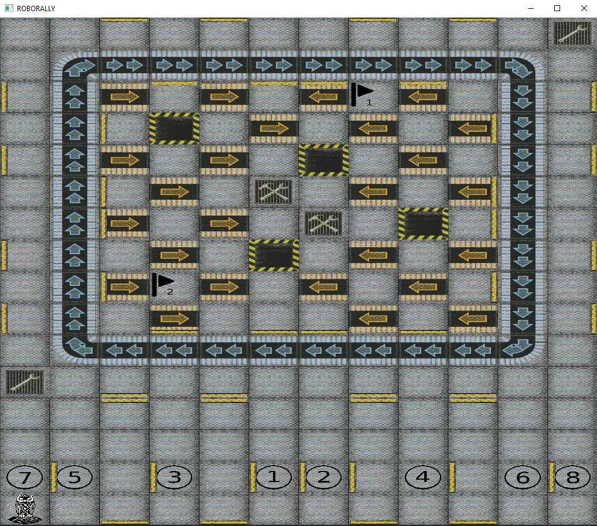

# INF112 Gruppe 10-2: Import TeamName

### Team Members:
- August Klevberg
- Eivind Mai
- Endre Tønnessen
- Jakob Svemo
- Sondre Eide

## How to run
* Clone project.
* Run main.java
* Move around with W,A,S,D.

Should look like this:

## Known bugs
