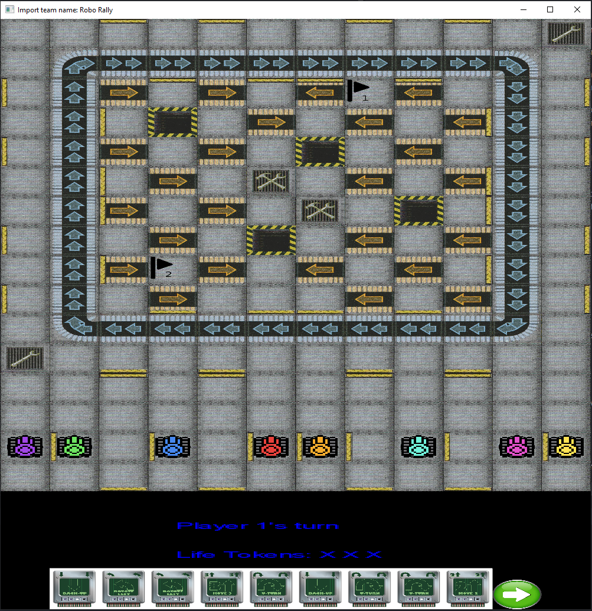

<h1 align="center">INF112 Gruppe 10-2</h1>

### Team Members:
- August Klevberg
- Eivind Mai
- Endre Tønnessen
- Jakob Svemo
- Sondre Eide

## What is Roborally?
Roborally is a boardgame developed in 1985 by Richard Garfield (Creator of Magic the Gathering), published in 1994 by Wizards of the Coast. 
This repo is a digital version of the original mainGame, using the old ruleset from 2005.

The rules can be found here: [Roborally Rules 2005](https://www.fgbradleys.com/rules/rules4/Robo%20Rally%20-%20rules.pdf)

Wiki of the mainGame: [Roborally Wiki](https://www.wikiwand.com/en/RoboRally)
## Project Setup

### Requirements
* Java 8+
* Version Control, git etc.
* Maven

### OS
* Mac
* Linux
* Windows

### Command line
Clone project: ``git clone git@github.com:inf112-v21/Import-TeamName.git``

Build the project.

Run ``Main.java`` located at  `src/main/java/inf112/skeleton/app/Main.java`

### Windows
Install a Java IDE, such as Eclipse or IntelliJ IDEA

Import the project from version control, as a Maven project.
Specify `pom.xml` as the configuration file for Maven.

Run the project, the main class is located at `src/main/java/inf112/skeleton/app/Main.java`, from Project root.

If executed properly you are presented with the main screen of the mainGame.

## How to play

### Singleplayer
* Run main.java
* A new screeen appears and the user is asked to select multiplayer or singleplayer. For singleplayer, choose the nr of players in the game, then optionally add their names, then press the map to be played.
* Move robot 1 by selecting five cards and clicking the submit button.
* The selected cards will appear as text in the CONSOLE and as blue 'highlights' over the choosen card.
* Then its the next players turn to choose card.
* When all have choosen, the game will proceed to execute the selected cards, and the gameloop beigns.

### For multiplayer:
--Multiplayer
*-Hosting-
* Select Online, press the "host" button.
* Play (with WASD only after everyone has joined)

* Joining
* Select Online, press the "find" button, it will try to find a server on LAN.
* If it finds any, it will refresh the "server ip" field, then press Join. If it fails to find any, the user may add the correct IPV4 address to the host (untested).
* The game is then played with, WASD.

## Alternative build:
* Navigate to repository main folder
* mvn clean install
* mvn compile
* mvn exec:java -Dexec.mainClass=inf112.skeleton.app.Main

DEBUG mode: Move around with W,A,S,D (activiated in the main class)

The main game screen should look like this:

### Tests
The mainGame uses Junit to automatically test the mainGame.

Manual tests for GUI and mainGame can be found under `Deliverables/ManuelTests/ManuelTests.md`,

### Debug
The mainGame has a limited debug mode. It can be toggled under `src/main/java/inf112/skeleton/app/Main.java`.

The debug mode disables moving by clicking on the cards, and instead uses WASD.

## Known bugs
* Resizing the window will currently break the clickable cards. Restart fixes it.
* !The Server does not shut itself down, when application is closed. The host of the game, either has to manually stop the process in their preferred IDE, or unbind their ports with commandline to start hosting again.
*   Commandline: `netstat -ano | findstr :8080` , then `taskkill /pid yourid /f` . Replace yourId with the Pid to the process.
* PLayers are still asked to submit cards after their deaths.
* When selecting the map ``Whirlwind``, the hitboxes of the cards are slightly pushed aside, causing the user to have to click above the cards.