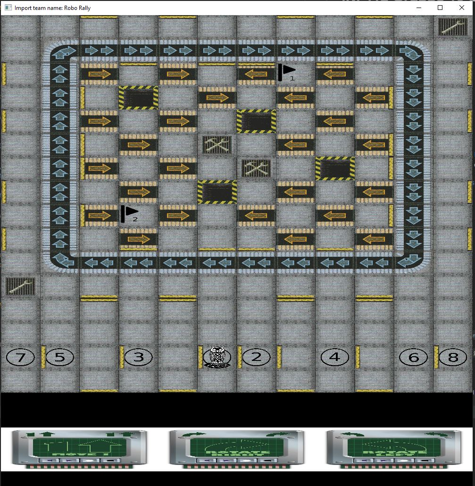

# INF112 Gruppe 10-2: Import TeamName

### Team Members:
- August Klevberg
- Eivind Mai
- Endre Tønnessen
- Jakob Svemo
- Sondre Eide

## What is Roborally?
Roborally is a boardgame developed in 1985 by Richard Garfield (Creator of Magic the Gathering), published in 1994 by Wizards of the Coast. 
This repo is a digital version of the original game, using the old ruleset from 2005.

The rules can be found here: [Roborally Rules 2005](https://www.fgbradleys.com/rules/rules4/Robo%20Rally%20-%20rules.pdf)

Wiki of the game: [Roborally Wiki](https://www.wikiwand.com/en/RoboRally)
## Project Setup

### Requirements
* Java 8+
* Version Control, git etc.
* Maven

### Command line
Clone project: ``git clone git@github.com:inf112-v21/Import-TeamName.git``

Run ``Main.java`` located at  `src/main/java/inf112/skeleton/app/Main.java`

### Windows
Install a Java IDE, such as Eclipse or IntelliJ IDEA

Import the project from version control, as a Maven project.
Specify `pom.xml` as the configuration file for Maven.

Run the project, the main class is located at `src/main/java/inf112/skeleton/app/Main.java`, from Project root.

If executed properly you are presented with the main screen of the game.

## How to play
* Run main.java
* A new screen appears, click on the green icon to start the game. 
* Move around with W,A,S,D (if debug mode turned on in the Main class)
* OR, click on the cards represented at the bottom of the screen (if debug mode off)

Should look like this:

## Known bugs
* Resizing the window will currently break the clickable cards. Restart fixes it.